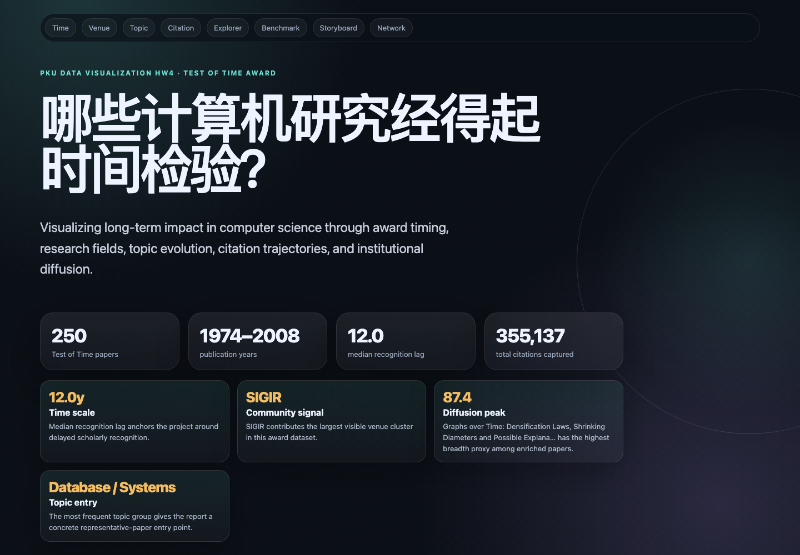
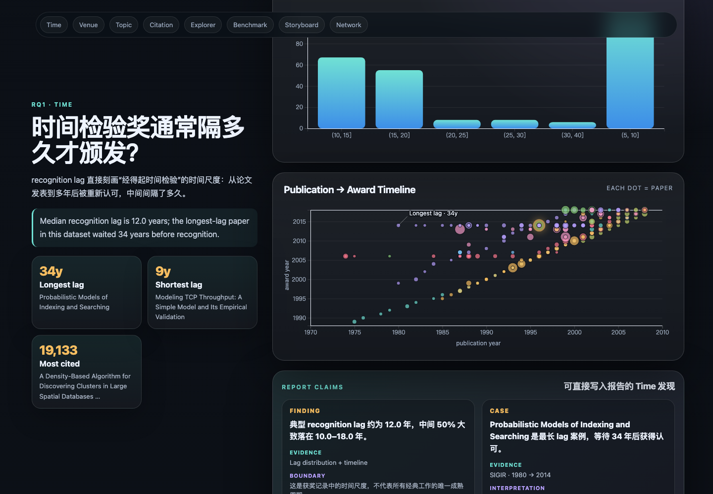
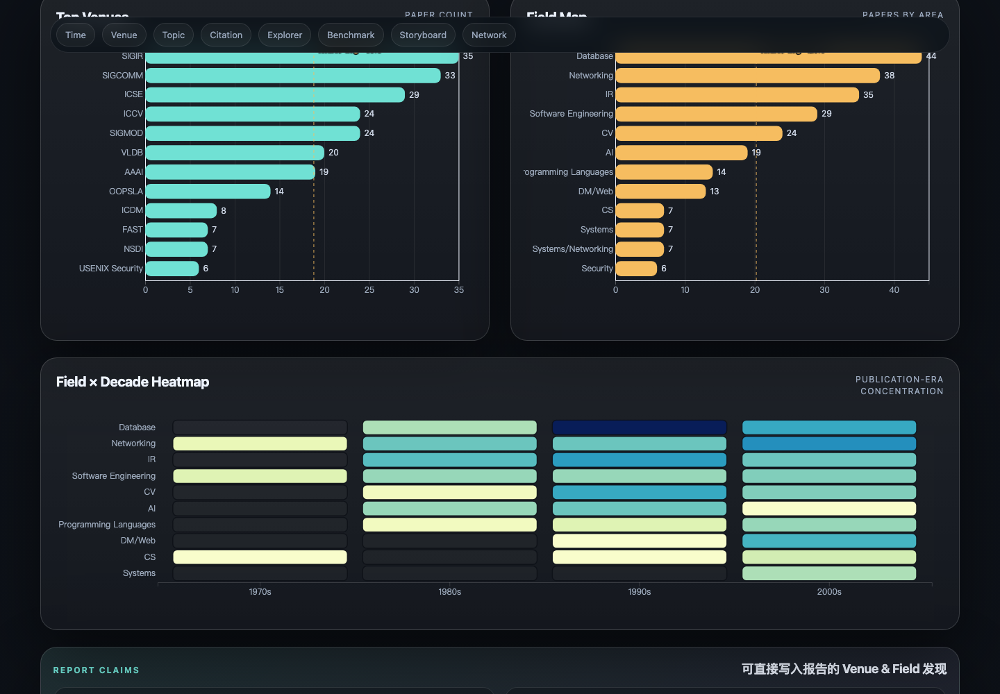
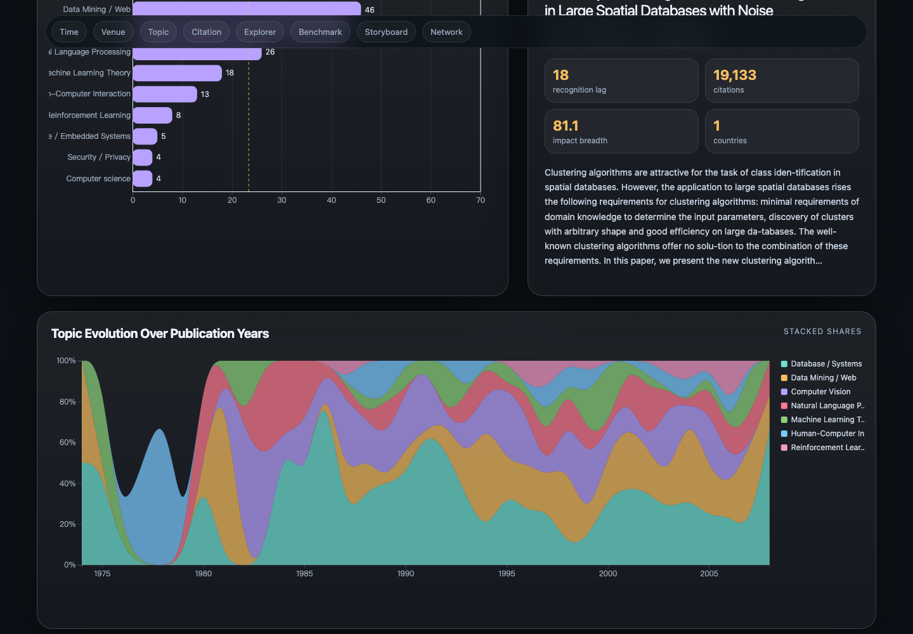
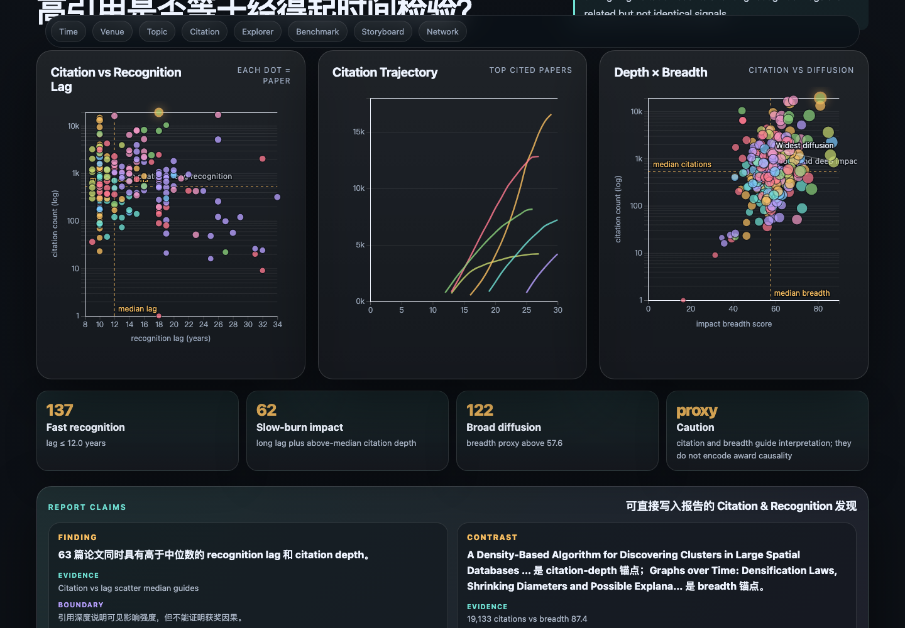
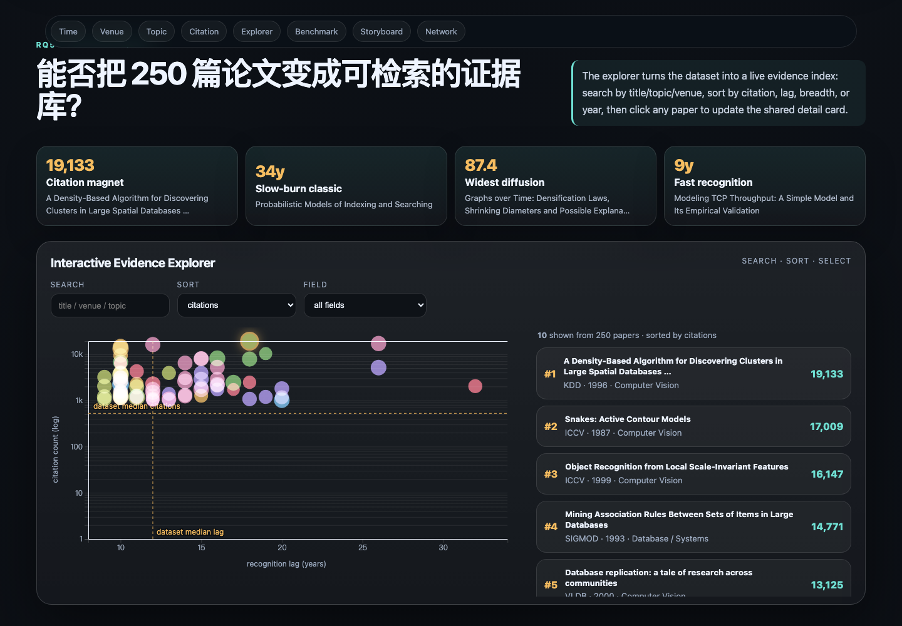
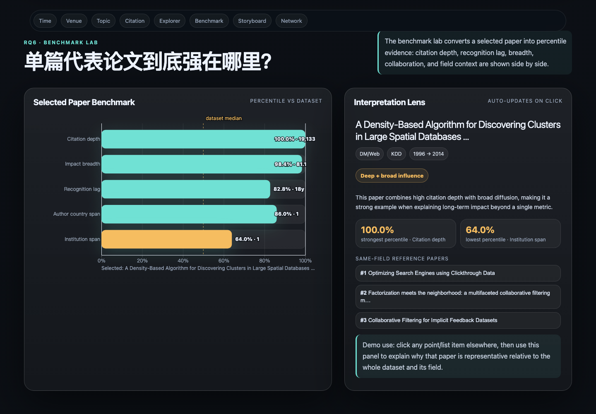
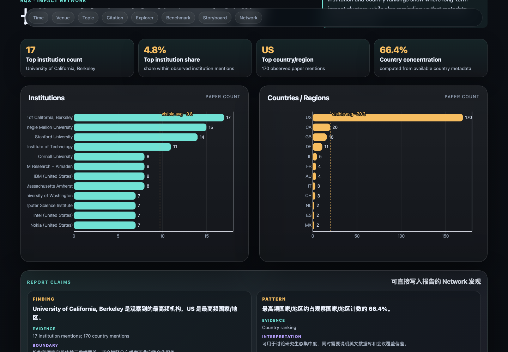

# 数据可视化 HW4 小组项目

## 项目题目

**哪些计算机研究经得起时间检验？——基于 Test of Time Award 数据的论文长期影响力可视化分析**

英文副标题：

**What Research Stands the Test of Time? Visualizing Long-Term Impact in Computer Science**

## 在线 Demo

GitHub Pages 目标地址：<https://leejamesss.github.io/pku-dataviz-hw4-test-of-time/>

如果在线页面暂时不可访问，请按下方“本地运行”启动静态服务器查看。

## 项目目标

本项目基于 Test of Time Award 论文数据，分析计算机领域中哪些研究在多年后仍然被认为具有重要影响。我们会从时间跨度、会议领域、研究主题、引用轨迹、影响扩散、作者机构网络等角度进行可视化分析。

核心问题：

> 一篇计算机论文在多年后仍被认为重要，通常具有什么共同特征？

## Demo 预览图

不安装任何环境时，可以先通过下面几张截图了解当前网页效果。完整交互版请按“本地运行”部分启动静态服务器后查看。课堂投影或截图时可打开 `http://127.0.0.1:8765/index.html?present=1`，或在页面中按 `P` 切换 Presentation mode。



| Time / Timeline | Venue / Field |
|---|---|
|  |  |

| Topic Evolution | Citation / Impact |
|---|---|
|  |  |

| Explorer / Evidence Index | Benchmark Lab |
|---|---|
|  |  |

| Network diffusion |
|---|
|  |

## 协作规则：必须 Pull Request，不要直接改 main

为了避免文件互相覆盖、方便统一审核，本仓库采用 **always PR** 协作方式。

1. 不要直接 push 到 `main` 分支。
2. 每个人做自己的任务时，先从 `main` 新建分支。
3. 修改完成后提交到自己的分支，并发 Pull Request。
4. PR 需要审核后再合并。
5. 如果多人要改同一个文件，请先在群里同步一下。

推荐流程：

```bash
git checkout main
git pull origin main
git checkout -b feature/your-name-task

# 修改文件后
git add .
git commit -m "add: your task description"
git push -u origin feature/your-name-task
```

然后在 GitHub 页面创建 Pull Request。

## 仓库结构

```text
.
├── README.md
├── index.html
├── docs/
│   ├── project_plan.md
│   ├── team_division.md
│   ├── work_board.md
│   ├── final_qa_checklist.md
│   ├── a_lead_quality_system.md
│   ├── module_handoff_cards.md
│   ├── quality_upgrade_plan.md
│   ├── stretch_backlog.md
│   ├── feature_iteration_system.md
│   ├── evidence_cards_top12.md
│   ├── methods_and_limitations.md
│   ├── presentation_pack.md
│   ├── qr_online_demo_handoff.md
│   ├── grading_rubric_full_score_mapping.md
│   ├── demo_script.md
│   ├── demo/
│   │   ├── homepage-overview.png
│   │   ├── time-and-timeline.png
│   │   ├── venue-and-field.png
│   │   ├── topic-evolution.png
│   │   ├── citation-and-impact.png
│   │   ├── explorer-evidence-index.png
│   │   ├── benchmark-lab.png
│   │   ├── network-diffusion.png
│   │   └── online-demo-qr.png
│   ├── report/
│   │   ├── contribution_A.md
│   │   └── report_skeleton.md
│   └── data_dictionary.md
├── data/
│   ├── papers_enriched.csv
│   ├── award_timeline.csv
│   ├── recognition_lag_distribution.csv
│   ├── venue_stats.csv
│   ├── venue_area_stats.csv
│   ├── topic_stats.csv
│   ├── topic_year_stats.csv
│   ├── citation_trajectories.csv
│   ├── citing_breadth_metrics.csv
│   ├── institution_stats.csv
│   └── country_stats.csv
├── manual_annotations/
│   ├── manual_paper_annotations_top60_template.csv
│   └── 按方向拆分的 5 份待补充表
├── src/
│   ├── app.js
│   └── styles.css
├── 小组作业说明.md
└── 小组作业说明-20260415.pdf
```

## 当前基础网页

仓库已经包含一个可直接运行的 D3 网页基础版：`index.html` + `src/app.js` + `src/styles.css`。

当前页面包含 8 个研究问题模块：

1. Time：recognition lag 分布和核心时间尺度；
2. Venue & Field：会议排名和领域分布；
3. Topic Evolution：主题分布、主题随年份演化和代表论文详情卡；
4. Citation & Recognition：引用量与 recognition lag 的关系、引用轨迹、影响深度/广度；
5. Paper Explorer：把 250 篇论文做成可检索、可排序、可点击联动详情卡的证据索引；
6. Benchmark Lab：把任意选中论文和全数据集/同领域中位数做 percentile 对比，生成讲解视角；
7. Story Builder：把每个模块转成“问题-证据-so what-owner”的报告展示主线；
8. Impact Network：机构和国家/地区分布。

B-F 主要模块末尾还加入了 report claim cards，把每个模块的发现拆成 `Finding / Evidence / Boundary` 或 `Case / Evidence / Interpretation`，方便队友直接迁移到最终报告并补充人工案例解释。

这个版本的目标是作为小组协作底座：大家可以并行补充数据解释、优化单个图表、增加交互，不需要从零搭页面。

## 本地运行

不要直接双击打开 `index.html`，因为浏览器可能拦截本地 CSV 读取。请在仓库根目录启动一个本地静态服务器：

```bash
python3 -m http.server 8765 --bind 127.0.0.1
```

然后在浏览器打开：

```text
http://127.0.0.1:8765/index.html
```

修改 `src/app.js` 或 `src/styles.css` 后，刷新网页即可查看效果。

## 分工概览

详细分工见：`docs/team_division.md`

Issue 分工表见：`docs/work_board.md`。组长可以在 GitHub 上把 #2–#7 分别 assign 给六位成员。A 的贡献记录见 `docs/report/contribution_A.md`，A 的质量系统见 `docs/a_lead_quality_system.md`。队友可以直接按 `docs/module_handoff_cards.md` 做模块增强；如果想继续提高完成度，按 `docs/quality_upgrade_plan.md` 中的模块级优化清单补发现、案例和限制。额外增强板块见 `docs/stretch_backlog.md`，持续提 feature / 开 Issue / PR 完成的循环见 `docs/feature_iteration_system.md`；已补充的材料包括 `docs/evidence_cards_top12.md`、`docs/methods_and_limitations.md`、`docs/presentation_pack.md` 和 `docs/qr_online_demo_handoff.md`。评分点覆盖关系见 `docs/grading_rubric_full_score_mapping.md`。最终报告可从 `docs/report/report_skeleton.md` 开始填，展示讲稿见 `docs/demo_script.md`，最终整合检查见 `docs/final_qa_checklist.md`。

| 成员 | 模块 | 主要任务 |
|---|---|---|
| A | 项目架构 / 全站 baseline / 队友减负 / GitHub 协作与最终整合 | GitHub 仓库与 PR 工作流、Issues 分工、全站 D3 baseline、队友任务卡、报告骨架、展示脚本、code review、最终整合和 QA |
| B | 时间线与 recognition lag | 分析发表年、获奖年、recognition lag，做时间线和分布图 |
| C | 会议 / 领域分布 | 分析 venue、venue_area，做会议排名、领域分布、热力图 |
| D | 主题演化 | 分析 topic_label / concepts，做主题演化和代表论文卡片 |
| E | 引用轨迹与影响深度/广度 | 分析 citation trajectory、citation count、impact breadth |
| F | 作者机构网络 / 视觉 / PPT | 做机构网络、国家分布、统一视觉风格、准备展示 PPT |


## 队友最快开始方式

如果只想快速进入自己的任务：

1. 先看 `docs/module_handoff_cards.md`，找到自己的 B-F 模块任务卡；
2. 按任务卡确认已有 baseline、主要数据文件、最低交付和可写进报告的句式；
3. 改完后按 PR 模板提交；
4. 报告阶段直接填 `docs/report/report_skeleton.md` 对应模块。

A 会负责主线、review、整合和最终 QA，保证各模块能拼成同一个完整网页故事。

## 推荐网页结构

1. Opening：项目引入和数据概览；
2. Time：时间检验奖一般多久后颁发；
3. Venue & Field：哪些会议/领域更容易产生长期影响；
4. Topic Evolution：长期影响论文的主题如何变化；
5. Citation & Recognition：高引用是否等于经得起时间检验；
6. Paper Explorer：检索、排序并定位代表论文证据；
7. Benchmark Lab：解释选中论文相对全数据和同领域的位置；
8. Impact Network：长期影响如何跨作者、机构、国家扩散。

## 数据使用说明

优先使用 `data/` 目录下的 CSV 文件。每个成员做图时，请在 PR 里说明：

- 使用了哪些数据文件；
- 使用了哪些字段；
- 图表回答了哪个问题；
- 得到了哪些主要发现。

字段说明见：`docs/data_dictionary.md`

## 手工补充任务

`manual_annotations/` 中有 Top 60 代表论文的待补充表。手工补充主要用于网页中的论文详情卡和展示案例。

补充时注意：

- 内容尽量简洁，适合放进网页；
- 重要判断尽量附 evidence_url；
- 不确定的影响不要硬写；
- 主题标签尽量统一。

## 提交前检查

每个 PR 合并前请检查：

- 图表能正常打开；
- 数据路径使用相对路径，不要写本地绝对路径；
- 图表标题、caption、tooltip 能让人看懂；
- 主要发现有文字说明；
- 没有提交 `.DS_Store`、缓存、临时文件、无关大文件；
- PR 描述写清楚改了什么。

仓库已提供 PR 模板：`.github/pull_request_template.md`。最终提交前按 `docs/final_qa_checklist.md` 做整体验证。

## 最终目标

最终作品应该呈现为一个完整的数据故事，避免只是几个图表拼在一起：

> 用可视化解释：哪些计算机研究真正经得起时间检验，以及这种长期影响力如何在时间、领域、主题、引用和合作网络中体现出来。
